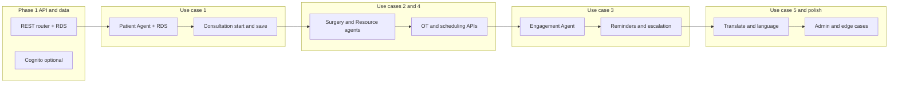

# CDSS Project Workflow After Dashboard

## Current state

- **Dashboard (working):** [apps/doctor-dashboard](d:\AI_Hackathon_CDSS\apps\doctor-dashboard) has Dashboard, Patients, PatientConsultation, AIChat, Surgery, SurgeryPlanning, Medications, Admin (Users, Audit, Config, Analytics), Settings. Data is mock or optional API via [src/api/client.js](d:\AI_Hackathon_CDSS\apps\doctor-dashboard\src\api\client.js).
- **Backend (two stacks):**  
  - [backend/](d:\AI_Hackathon_CDSS\backend): Supervisor + 5 agents (Bedrock, EventBridge, DynamoDB sessions), REST dashboard_handler, WebSocket handler, MCP stubs.  
  - [src/cdss/api/handlers/](d:\AI_Hackathon_CDSS\src\cdss\api\handlers): Minimal Python handlers; [router.py](d:\AI_Hackathon_CDSS\src\cdss\api\handlers\router.py) returns static JSON.
- **Infra:** [infrastructure/](d:\AI_Hackathon_CDSS\infrastructure): Terraform, API Gateway `/api/{proxy+}` → single CDSS Lambda. [backend/database/schema.sql](d:\AI_Hackathon_CDSS\backend\database\schema.sql): RDS-oriented schema (patients, consultations, surgery_plans, prescriptions, etc.).

---

## Part A: Dashboard improvements (by use case)

Map each primary use case to concrete UI changes and where they live in the app.

### 1. Clinical consultation support (Use case 1)

| Change                               | Location                                                                                                                    | Purpose                                                                             |
| ------------------------------------ | --------------------------------------------------------------------------------------------------------------------------- | ----------------------------------------------------------------------------------- |
| **"Start consultation"** action      | [PatientConsultation.jsx](d:\AI_Hackathon_CDSS\apps\doctor-dashboard\src\pages\PatientConsultation\PatientConsultation.jsx) | Explicit trigger so backend can run Patient Agent → Bedrock summary.                |
| **AI summary above the fold**        | Same page                                                                                                                   | Show Bedrock-generated summary and recommendations first; consultation notes below. |
| **"Save consultation notes"** button | Same page                                                                                                                   | Persist notes + AI summary via API (consultations table).                           |
| **Consultation time metric**         | Dashboard or Settings                                                                                                       | Display "Time saved this session" (target 5–8 min per patient) for success metrics. |

**Flow:** Doctor opens patient → clicks "Start consultation" → frontend calls `POST /api/v1/consultations/start` with patientId → backend runs Patient Agent + Bedrock → returns summary; doctor edits notes and clicks "Save" → `POST /api/v1/consultations` saves to RDS.

### 2. Surgical coordination and planning (Use case 2)

| Change                                 | Location                                                                                                        | Purpose                                                                     |
| -------------------------------------- | --------------------------------------------------------------------------------------------------------------- | --------------------------------------------------------------------------- |
| **"Surgery required"** action          | PatientConsultation or Patient header                                                                           | Trigger to create surgery request and open Surgery Planning flow.           |
| **OT availability in SurgeryPlanning** | [SurgeryPlanning.jsx](d:\AI_Hackathon_CDSS\apps\doctor-dashboard\src\pages\SurgeryPlanning\SurgeryPlanning.jsx) | Resource Agent: show available OT slots when selecting OT.                  |
| **Book slot** CTA                      | SurgeryPlanning                                                                                                 | Call Scheduling Agent to book slot; show confirmation and real-time status. |
| **Real-time updates**                  | Already wired                                                                                                   | Keep WebSocket subscription for surgical team updates (already in place).   |

**Flow:** Doctor marks "Surgery required" → Surgery Agent analyses requirements → SurgeryPlanning shows checklist + OT dropdown (Resource Agent) → Doctor selects slot → Scheduling Agent books → WebSocket pushes updates to team.

### 3. Medication adherence (Use case 3)

| Change                                   | Location                                                                                            | Purpose                                                                         |
| ---------------------------------------- | --------------------------------------------------------------------------------------------------- | ------------------------------------------------------------------------------- |
| **"Schedule reminder"** / "Send nudge"** | [Medications.jsx](d:\AI_Hackathon_CDSS\apps\doctor-dashboard\src\pages\Medications\Medications.jsx) | Call Engagement Agent to schedule reminder (SMS/voice via Pinpoint).            |
| **Escalation alerts**                    | Dashboard or dedicated Alerts widget                                                                | When patient misses 3+ doses, show "Escalation: [Patient]" for doctor/nurse.    |
| **Adherence trend**                      | Medications or Admin Analytics                                                                      | Chart or metric: adherence rate (target +25%); feed from Pinpoint/reminder_log. |

**Flow:** Doctor prescribes or nurse records → Engagement Agent schedules reminder; at reminder time Pinpoint sends SMS/voice; missed dose logged → escalation rule triggers → dashboard shows alert.

### 4. Resource optimization (Use case 4)

| Change                             | Location                                                                                            | Purpose                                                                        |
| ---------------------------------- | --------------------------------------------------------------------------------------------------- | ------------------------------------------------------------------------------ |
| **OT utilization and conflicts**   | [AdminAnalytics.jsx](d:\AI_Hackathon_CDSS\apps\doctor-dashboard\src\pages\Admin\AdminAnalytics.jsx) | Resource Agent: OT utilization %, conflict list; target +30% utilization.      |
| **Resource view (OT / equipment)** | New page or Admin section                                                                           | List OTs and equipment status; allocation recommendations from Resource Agent. |
| **Conflict alerts**                | Dashboard (Admin) or Surgery                                                                        | When two surgeries compete for same OT, show alert and resolution CTA.         |

**Flow:** New surgery request or availability change → Resource Agent checks OT/instruments → Admin dashboard and Surgery views show status and conflicts.

### 5. Multilingual patient communication (Use case 5)

| Change                              | Location                                             | Purpose                                                    |
| ----------------------------------- | ---------------------------------------------------- | ---------------------------------------------------------- |
| **Language preference**             | Patient header or Consultation                       | Dropdown: Hindi, Tamil, Telugu, Bengali, English.          |
| **Summaries in preferred language** | PatientConsultation (summary block) + Patient portal | Backend uses Translate; frontend shows translated summary. |
| **Reminder language**               | Reminders / Engagement                               | Engagement Agent sends reminders in patient’s language.    |

**Flow:** Patient prefers regional language → Transcribe/Translate in pipeline → summaries and reminders in that language; satisfaction metric >4.5/5.

### Personas and roles (sidebar and routes)

| Persona     | Current                         | Improvement                                                                                      |
| ----------- | ------------------------------- | ------------------------------------------------------------------------------------------------ |
| **Doctor**  | Full access                     | Add "Start consultation", "Surgery required", adherence alerts.                                  |
| **Surgeon** | Surgery, SurgeryPlanning        | Add OT availability and book-slot from Planning.                                                 |
| **Nurse**   | Same as doctor today            | Dedicated "Nurse" view: patient schedule, vitals entry, task list (optional new page or filter). |
| **Admin**   | Users, Audit, Config, Analytics | Add OT utilization, conflict list, adherence reports.                                            |
| **Patient** | Separate portal (partial)       | Complete patient portal: history, summaries, medications, reminder preferences, language.        |

Optional later: Pharmacist (prescription verification, drug-interaction view), Medical Student (read-only anonymized cases).

---

## Part B: Backend implementation workflow

Use one backend and one API surface so the dashboard has a single contract.

### Backend choice

- **Recommendation:** Use [backend/](d:\AI_Hackathon_CDSS\backend) (Lambda agents, Bedrock, EventBridge, DynamoDB for sessions) for agent logic.  
- **Persistence:** Add RDS (or reuse existing Terraform RDS) and run [backend/database/schema.sql](d:\AI_Hackathon_CDSS\backend\database\schema.sql) so consultations, surgery_plans, prescriptions, and reminder_log are in one place.  
- **API surface:** Either (a) extend Terraform API Gateway to route `/dashboard`, `/api/v1/`* to a **single REST router Lambda** that invokes the existing backend agents and reads/writes RDS, or (b) deploy the CDSS-Frontend [infra/](d:\AI_Hackathon_CDSS\infra) (CDK) and add missing routes there. Prefer **Terraform** if the rest of the repo is Terraform-driven.

### Suggested implementation order

1. **Phase 1 – API and data (foundation)**
  - Add RDS (if not already) and apply schema (patients, consultations, vitals_history, surgery_plans, prescriptions, reminder_log, audit_log).  
  - Implement a **REST router** (e.g. in [src/cdss/api/handlers](d:\AI_Hackathon_CDSS\src\cdss\api\handlers) or a new Lambda): parse path/method, call the appropriate backend agent or direct RDS, return JSON.  
  - Expose in Terraform: `GET /dashboard`, `GET/POST /api/v1/patients`, `POST /api/v1/consultations/start`, `POST /api/v1/consultations`, `GET/POST /api/v1/surgeries`, `GET /api/v1/resources`, `POST /api/v1/reminders`, `GET /api/v1/admin/`*.  
  - Optional: Cognito User Pool and JWT authorizer so dashboard sends Bearer token.
2. **Phase 2 – Use case 1 (consultation support)**
  - Patient Agent: on `POST /api/v1/consultations/start`, load patient from RDS, call Bedrock for summary, return summary to frontend.  
  - Save: `POST /api/v1/consultations` with notes + AI summary → insert into RDS.  
  - Dashboard: wire "Start consultation" and "Save consultation notes" to these endpoints; show AI summary prominently.
3. **Phase 3 – Use cases 2 and 4 (surgery and resources)**
  - Surgery Agent: analyse requirements, generate checklist; persist to surgery_plans.  
  - Resource Agent: OT and equipment availability (from MCP or RDS); conflict detection.  
  - Scheduling Agent: book OT slot, update surgery_plans and schedules.  
  - API: `GET/POST /api/v1/surgeries`, `GET /api/v1/resources/ot`, `POST /api/v1/schedule/book`.  
  - Dashboard: "Surgery required" → create surgery → SurgeryPlanning shows OT from Resource Agent and "Book slot" calling Scheduling Agent; Admin Analytics shows OT utilization.
4. **Phase 4 – Use case 3 (medication adherence)**
  - Engagement Agent: schedule reminder (store in reminder_log), trigger Pinpoint SMS/voice; on missed doses run escalation (e.g. EventBridge → Lambda → notify doctor).  
  - API: `POST /api/v1/reminders`, `GET /api/v1/me/reminders` (patient portal).  
  - Dashboard: "Send nudge" / "Schedule reminder" on Medications page; escalation alerts on Dashboard or Alerts component.
5. **Phase 5 – Use case 5 and hardening**
  - Translate: for summaries and reminders, call Amazon Translate with patient language preference.  
  - Dashboard: language selector; show translated summary when available.  
  - Edge cases: drug-allergy checks (Bedrock Guardrails or Comprehend Medical), audit logging for all writes, and DISHA/compliance in Admin (audit export, data locality).

---

## Part C: Where to implement (files and repos)

| Layer            | Where                                                                             | What to add or change                                                                                                                                 |
| ---------------- | --------------------------------------------------------------------------------- | ----------------------------------------------------------------------------------------------------------------------------------------------------- |
| **Frontend**     | [apps/doctor-dashboard](d:\AI_Hackathon_CDSS\apps\doctor-dashboard)               | New CTAs and API calls (consultation start/save, surgery required, book slot, reminders, language); escalation alerts; optional Nurse view.           |
| **API contract** | Shared doc or OpenAPI                                                             | Document paths and payloads for dashboard and backend so both stay in sync.                                                                           |
| **REST router**  | [src/cdss/api/handlers](d:\AI_Hackathon_CDSS\src\cdss\api\handlers) or new Lambda | Route `/api/v1/`* to backend agents or RDS; keep [backend/](d:\AI_Hackathon_CDSS\backend) agents as the core logic.                                   |
| **Agents**       | [backend/agents](d:\AI_Hackathon_CDSS\backend\agents)                             | Ensure Patient Agent reads/writes RDS; Surgery/Resource/Scheduling/Engagement integrate with RDS and EventBridge/Pinpoint as per implementation-plan. |
| **DB**           | [backend/database/schema.sql](d:\AI_Hackathon_CDSS\backend\database\schema.sql)   | Add tables if needed (e.g. reminder_log, audit_log); ensure consultations, surgery_plans, prescriptions are used by agents.                           |
| **Infra**        | [infrastructure](d:\AI_Hackathon_CDSS\infrastructure)                             | API Gateway routes for new paths; Lambda (router) with VPC if it talks to RDS; optional Cognito and WebSocket.                                        |

---

## Part D: Success metrics and monitoring

- **Consultation:** Time saved per consultation (e.g. CloudWatch metric or log-derived); target 5+ minutes.  
- **Surgery/OT:** OT setup time reduction and utilization (RDS + Admin Analytics); target ~40% and +30%.  
- **Adherence:** Adherence rate from reminder_log and Pinpoint; target +25%.  
- **Multilingual:** Patient satisfaction (e.g. in-app or survey); target >4.5/5.

Add minimal CloudWatch metrics or log aggregation in the REST router and agents so these can be measured and surfaced in Admin Analytics later.

---

## Summary

- **Dashboard:** Add use-case-specific actions (consultation start/save, surgery required, OT book slot, schedule reminder, language) and persona-oriented views (Nurse, Admin OT and adherence).  
- **Backend:** One REST API backed by [backend/](d:\AI_Hackathon_CDSS\backend) agents and RDS; implement in order: (1) router + RDS, (2) consultation flow, (3) surgery and resources, (4) reminders and escalation, (5) multilingual and edge cases.  
- **Infra:** Terraform API Gateway (and optional Cognito/WebSocket) with routes that match the dashboard’s [api/client.js](d:\AI_Hackathon_CDSS\apps\doctor-dashboard\src\api\client.js) so the app can switch from mock to live in one place.

