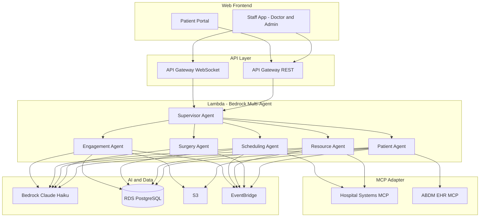
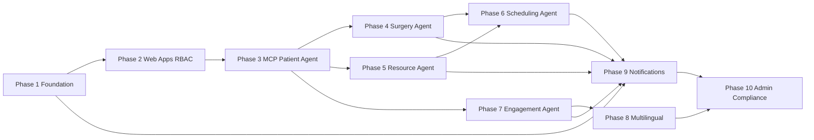

# CDSS Implementation Plan

**Version:** 1.0  
**Scope:** Web-only CDSS (Staff dashboard + Patient portal + Admin section), serverless-first, AWS ap-south-1, DISHA-aligned, target budget <$100/month.  
**References:** [requirements.md](requirements.md), [design.md](design.md).

---

## 1. Architecture Summary

### 1.1 Frontend (Web Only)

| App | URL / Hosting | Roles | Purpose |
|-----|----------------|-------|---------|
| **Staff web app** | e.g. `dashboard.cdss.in` (CloudFront + S3 or Amplify) | Doctor, Nurse, Admin | Doctor view (clinical workflows, all 5 agents) + Admin section (users, audit, config, analytics) |
| **Patient portal** | e.g. `patient.cdss.in` (CloudFront + S3 or Amplify) | Patient | Own history, summaries, medications, reminder preferences |

- No mobile app. Patient portal is responsive (use from phone browser if needed).
- Notifications to patients: SMS + voice (Pinpoint); optional “View in browser” links to patient portal.

### 1.2 High-Level System Diagram

### 1.3 Simplified Technology Choices

| Area | Choice | Rationale |
|------|--------|-----------|
| Real-time surgical | API Gateway WebSocket + Lambda | Avoid 24/7 Fargate; add Fargate only if Lambda limits hit |
| RAG (patient history) | RDS PostgreSQL + pgvector | Single DB; add OpenSearch only when scale demands |
| NER / entity extraction | Bedrock-first | Add Comprehend Medical only for high-accuracy needs |
| Session state & medication schedules | RDS | One DB to operate; DynamoDB only if scale requires |
| MCP | Single adapter layer; phased | Phase 1: Hospital + ABDM; Phase 2: Clinical Protocols; Phase 3: Telemedicine |
| Admin analytics | React-based admin (tables/charts) | Defer QuickSight to control cost |
| WAF | Defer | Use Cognito + API Gateway throttling initially |

### 1.4 Storage Overview

The plan uses **two storage services** (RDS + S3). No DynamoDB in MVP.

| Storage | What is stored | Rough size (MVP) | Notes |
|---------|----------------|------------------|--------|
| **RDS PostgreSQL** | Users/roles link, audit log, patients, consultations, surgeries, resources, schedules, medication_schedules, agent_sessions, conversation records, reminder_log, pgvector embeddings, WebSocket connectionIds (optional), system config, OT metrics | **5–15 GB** for small hospital / pilot | db.t3.micro includes **20 GB** storage by default; sufficient for MVP. Enable encryption at rest. Plan retention for audit (e.g. 1–2 years) and archive old data if needed. |
| **S3** | Medical documents, raw consult transcripts (if kept), knowledge corpus (if any), media uploads (voice), static assets for Staff app and Patient portal (CloudFront origin) | **1–5 GB** for MVP | Use lifecycle rules for transcripts/media (e.g. move to Glacier after 90 days) to control cost. |

**Is it okay?** Yes. One RDS instance (20 GB) and one S3 bucket keeps storage simple and within a &lt;$100/month budget. RDS holds all structured and session data; S3 holds blobs and frontend assets. Add RDS storage (up to ~100 GB on t3.micro) or DynamoDB only when volume or access patterns justify it.

### 1.5 Infrastructure Base (Terraform)

CDSS infrastructure is based on the [emergency-medical-triage Terraform](https://github.com/Rvk18/emergency-medical-triage/tree/main/infrastructure) repo. Use it as the starting point and apply the adaptations below.

**What the triage repo provides (reuse as-is or with small edits):**

| Component | In triage repo | Use for CDSS |
|-----------|----------------|---------------|
| **Terraform** | versions.tf (AWS ~5.x, archive, null), provider.tf | Same; set region to `ap-south-1` |
| **VPC** | vpc.tf – VPC 10.0.0.0/16, 2 private subnets (a, b), Aurora subnet group, SG (5432 from VPC) | Keep; ensures RDS in private subnets |
| **RDS** | rds.tf – Aurora PostgreSQL 15.10, Serverless v2 (0.5–1 ACU), encrypted, IAM auth, `triagedb` | Reuse; change `database_name` to `cdssdb` (or keep and add CDSS schema). Enable **pgvector** in DB after first apply |
| **S3** | s3.tf – bucket with versioning, AES256, public access block | Keep; use for documents, transcripts, media, and frontend static assets |
| **Bedrock** | bedrock.tf – IAM policy for InvokeModel, InvokeModelWithResponseStream, InvokeAgent | **Add** `ap-south-1` ARNs (CDSS is Mumbai); keep us-east-1 etc. if you use cross-region inference |
| **API Gateway** | api_gateway.tf – REST API, /health, /triage, Lambda proxy | Extend: add routes for CDSS (e.g. /api/v1/* proxy to Supervisor Lambda); add **WebSocket API** for real-time surgical |
| **Lambda** | lambda.tf (health), triage.tf (Python 3.12, Bedrock, 120s) | Replace triage with **Supervisor** Lambda; add Lambdas (or single router) for Patient, Surgery, Resource, Scheduling, Engagement agents. Attach **VPC config** (same subnets as RDS) so Lambda can reach Aurora |
| **Secrets** | secrets.tf (referenced in outputs) | Reuse pattern for DB and Bedrock config; add Cognito app client secrets if needed |

**Required adaptations for CDSS:**

1. **Region and naming** – Set `aws_region` default to `ap-south-1` (Mumbai) for data residency and DISHA. Set `project_name` to e.g. `cdss`.

2. **Bedrock** – In `bedrock.tf`, add `ap-south-1` to the policy Resource ARNs (e.g. `arn:aws:bedrock:ap-south-1::foundation-model/*`, `arn:aws:bedrock:ap-south-1:*:inference-profile/*`) so Lambdas in ap-south-1 can invoke Claude.

3. **Database** – Change Aurora `database_name` to `cdssdb` (or create a `cdss` schema in `triagedb`). After first apply, connect (bastion/IDE) and run `CREATE EXTENSION IF NOT EXISTS vector;` for pgvector.

4. **Cognito** – Add **Cognito** User Pool and App Client(s) (Terraform); no equivalent in triage repo. Use for Staff and Patient app login and JWT (role, doctorId/patientId).

5. **API Gateway** – Add REST resources for CDSS (e.g. `/api/v1`, proxy to Supervisor or router Lambda). Add **WebSocket API** (connect, disconnect, default route) and Lambda for connection management and surgical events.

6. **Lambdas and VPC** – Supervisor and all agent Lambdas need to run in the same VPC as Aurora (private subnets) so they can reach RDS. Add `vpc_config` (subnet_ids, security_group_ids) and a security group allowing Lambda to Aurora 5432 (or reuse Aurora SG with Lambda ENIs in VPC).

7. **EventBridge** – Optional: add EventBridge rule(s) and targets for async inter-agent messaging (decoupled, auditable); can be added in a later phase.

8. **Budget note** – Aurora Serverless v2 (min 0.5 ACU) has a higher baseline cost than a single db.t3.micro. If under $100/month is strict, add a variable (e.g. `db_engine_mode = "provisioned"` with `db.t3.micro` instance) and use a single RDS instance instead of Aurora Serverless v2; otherwise keep Aurora for scalability.

**Suggested repo layout:** Clone or copy the triage `infrastructure/` folder into your CDSS repo (e.g. `infrastructure/` at repo root). Apply the changes above and add new files (e.g. `cognito.tf`, `api_gateway_websocket.tf`, `lambda_supervisor.tf`) so the plan's Phase 1 aligns with this Terraform.

---

## 2. Implementation Phases

### Phase 1: Foundation and Infrastructure

**Goal:** AWS footprint, auth, single database, and API surface so all later work can assume authenticated, role-based access and persistence.

**Tasks:**

1. **AWS account and region**
   - Use ap-south-1 (Mumbai); ensure Bedrock and required services are enabled.
   - Set up a single VPC (or default) and IAM roles for Lambda, API Gateway, and (if used) Amplify/CloudFront.

2. **Authentication and RBAC**
   - Amazon Cognito: User pool with attributes for `role` (doctor, nurse, admin, patient) and optional `doctorId` / `patientId`.
   - JWT with role and identifiers; validate in API Gateway (Lambda authorizer) or in Lambda.
   - After login: redirect Staff (doctor/nurse/admin) to Staff app, Patient to Patient portal (Req 1.3, 1.7).

3. **Database**
   - RDS PostgreSQL (e.g. db.t3.micro, single-AZ) in private subnet.
   - Store: users (or link to Cognito), roles, audit log table (user_id, action, resource, timestamp), and placeholders for patients, consultations, surgeries, resources, schedules, medication_schedules, agent_sessions.
   - Enable pgvector extension for later RAG (Phase 3).
   - Secrets Manager for DB credentials; encryption at rest.

4. **API layer**
   - API Gateway REST API: base path e.g. `/api/v1`, Lambda proxy integration.
   - API Gateway WebSocket API: connect, disconnect, default route; Lambda for connection management (store connectionId in RDS or DynamoDB if preferred later).
   - One Lambda “router” or “gateway” that forwards to Supervisor (or invoke Supervisor Lambda directly from API).

5. **Audit and DISHA alignment**
   - Log every authenticated request (who, what, when) to RDS audit table; ensure no patient data in logs without masking (Req 1.4, 1.5; design Property 22).

**Deliverables:** Cognito working; RDS created and migrated (initial schema); REST + WebSocket APIs deployed; Lambda authorizer and audit logging in place.

---

### Phase 2: Staff and Patient Web Apps (Shells) and RBAC

**Goal:** Two web apps with login and role-based routing; no patient can access staff app or other patients’ data.

**Tasks:**

1. **Staff web app (React)**
   - Create React app (e.g. Vite + React Router).
   - Login via Cognito; on success read JWT role → if doctor/nurse/admin, show Staff app.
   - Shell: navigation for “Doctor” (dashboard, patients, surgery, scheduling, resources) and “Admin” (only visible if role === admin): Users, Audit log, System config, Analytics placeholder.
   - All API calls send JWT; backend validates role and resource access (Req 1.1, 1.6).

2. **Patient portal (React)**
   - Separate React app (or same repo, different entry).
   - Login via Cognito; if role === patient, show Patient portal only.
   - Shell: navigation for My history, Summaries, Medications, Reminders (preferences).
   - API enforces patient can only read/write own data (Req 1.2, 1.6).

3. **RBAC enforcement in API**
   - Every endpoint: resolve user from JWT, check role, and for patient-scoped data check resource (e.g. patientId) matches identity.
   - Return 403 for cross-patient or admin-only access.

**Deliverables:** Staff app (Doctor + Admin sections) and Patient portal reachable after login; RBAC enforced in backend; audit log populated for access.

---

### Phase 3: MCP Adapter and Patient Agent (with RAG)

**Goal:** Single MCP adapter for external systems; Patient Agent with patient CRUD, history, and surgery readiness; RAG over patient history.

**Tasks:**

1. **MCP adapter layer**
   - Implement one “MCP adapter” Lambda or module that agents call.
   - Adapter exposes: `getHospitalData(type)` (OT status, beds), `getABDMRecord(patientId)` (or equivalent). Stub responses for Phase 1 MCPs (Hospital, ABDM) if external APIs not ready.
   - Design so Clinical Protocols and Telemedicine MCPs can be added later without changing agent interfaces.

2. **Patient data model and API**
   - Implement [PatientRecord](design.md) in RDS (patients, demographics, medical_history, visits, etc.).
   - Patient Agent: createPatient, getPatientHistory, updateRecord, assessSurgeryReadiness (Req 2.1–2.7).
   - Ensure single Patient_ID per patient and no duplicates (design Property 2).

3. **RAG for patient summaries**
   - Store embeddings (from Bedrock) in RDS using pgvector; chunk patient history and consultations.
   - Patient Agent: on “getSummary” or “surgery readiness”, retrieve relevant chunks, call Bedrock for structured summary/readiness; target ≤30s (Req 2.5; design Property 19).

4. **Staff app – Doctor view**
   - Patient list and detail pages; call Patient Agent APIs; show history, summary, surgery readiness.

5. **Patient portal – My history**
   - Patient sees own history and summaries via same backend (role-checked).

**Deliverables:** MCP adapter (stubbed or live for Hospital + ABDM); Patient Agent with RAG-based summaries and surgery readiness; Doctor and Patient UIs showing patient data.

---

### Phase 4: Surgery Agent and Surgical Workflow

**Goal:** Surgery classification, requirements, checklists, and real-time support via WebSocket.

**Tasks:**

1. **Surgery data model**
   - Implement [Surgery](design.md) and [SurgeryRequirements](design.md) in RDS (surgeries, requirements, instruments, team, status, etc.).

2. **Surgery Agent**
   - classifySurgery, determineRequirements, generateChecklist (Req 3.1–3.5; design Properties 4, 24).
   - Real-time: provideProcedureGuidance, trackSurgicalProgress; consume events from EventBridge or direct WebSocket messages (Req 3.6, 3.7; design Property 5).

3. **Supervisor**
   - Route intents like “analyseSurgery”, “getChecklist”, “getProcedureGuidance” to Surgery Agent; aggregate responses.

4. **Staff app – Surgery planning**
   - Surgery Planning UI: request analysis, view checklist and requirements; optional real-time view (WebSocket) for ongoing procedure.

5. **WebSocket**
   - Lambda on WebSocket route: forward surgical events to connected clients (e.g. connectionId stored at connect); use for live instrument/step updates.

**Deliverables:** Surgery Agent integrated; surgery planning and real-time support in Staff app; WebSocket used for live updates.

---

### Phase 5: Resource Agent and Real-Time Resource Tracking

**Goal:** Staff, OT, and equipment availability; conflict detection; inventory (in RDS).

**Tasks:**

1. **Resource data model**
   - [HospitalResource](design.md), staff, equipment, OT tables in RDS; availability, schedule, conflicts (Req 4.3, 4.5, 4.6).

2. **Resource Agent**
   - getStaffAvailability, getEquipmentStatus, getOTAvailability, detectConflicts, allocateEquipment (Req 4.1–4.7; design Property 6).
   - Ingest from MCP adapter (Hospital Systems MCP) for OT/beds; keep local copy in RDS with timestamps.

3. **Staff app – Resources**
   - Views: OT availability, equipment status, staff list with specialty and status; conflict alerts.

**Deliverables:** Resource Agent and MCP integration for hospital data; Staff app resource views.

---

### Phase 6: Scheduling Agent and Doctor Replacement

**Goal:** Optimized scheduling and automatic replacement identification and notification.

**Tasks:**

1. **Scheduling logic**
   - optimizeSchedule (Req 5.1–5.4), findReplacement (Req 5.5, 5.6), balanceWorkload, prioritizeEmergencies (design Properties 7, 8).
   - Use Resource Agent and Surgery Agent outputs; store schedules in RDS.

2. **Scheduling Agent**
   - bookSlot, resolveConflict; call Resource Agent for availability; on “doctor unavailable”, compute replacements and trigger notifications (Req 5.5–5.6).

3. **Notifications (internal)**
   - Use EventBridge + Lambda (or SNS) to notify replacement doctors and team (e.g. email via SES or in-app later); log in audit (Req 5.6).

4. **Staff app – Scheduling**
   - OT booking, schedule view, replacement suggestions and confirmation.

5. **OT utilization**
   - Store metrics in RDS; Admin section can show simple analytics (Req 5.9).

**Deliverables:** Scheduling Agent; booking and replacement flow; internal notifications; Admin view for utilization.

---

### Phase 7: Patient Engagement Agent and Conversation Intelligence

**Goal:** Conversation transcription, entity extraction, summaries, medication reminders, and escalation.

**Tasks:**

1. **Conversation and engagement data model**
   - [ConversationRecord](design.md), transcripts, medical entities, medication_schedules, reminder_log in RDS (and S3 for raw transcripts if needed).

2. **Engagement Agent**
   - transcribeConversation (use Transcribe when voice input), extractMedicalEntities (Bedrock-first), generatePatientSummary, createMedicationReminders, trackAdherence (Req 6.1–6.7; design Properties 9, 10).
   - Send reminders via Pinpoint (SMS) and voice; escalate to doctor on non-adherence (EventBridge or SNS → Lambda → SES or in-app).

3. **Patient portal**
   - View conversation summaries, medications, reminder preferences; optional “record conversation” (upload audio → Transcribe → Engagement Agent).

4. **Staff app**
   - Doctor view: trigger summary generation, view adherence reports; configure escalation.

**Deliverables:** Engagement Agent; transcription and entity extraction; reminders via SMS/voice and escalation; Patient portal and Doctor view updated.

---

### Phase 8: Multilingual and India-First Localization

**Goal:** Translation, simplified medical terms, and culturally appropriate content (Req 7).

**Tasks:**

1. **Translate**
   - Use Amazon Translate for major Indian languages in summaries, labels, and patient-facing text (Req 7.1, 7.2, 7.6).
   - Prescription labels and patient education content in multiple languages (Req 7.3; design Property 23).

2. **Speech (optional)**
   - Transcribe for speech-to-text; optional synthesis for voice reminders (Req 7.4).

3. **Cultural adaptation**
   - Prompt and content guidelines for regional practices (Req 7.5); apply in Patient Agent and Engagement Agent (design Properties 11, 21).

4. **Medical terminology**
   - Validate Indian drug names and terms; target 90% accuracy (Req 7.7).

**Deliverables:** Translate integrated; multilingual labels and summaries; optional speech; cultural and terminology checks.

---

### Phase 9: Notifications and Emergency Response

**Goal:** Alerts for drug interactions, critical vitals, surgical complications; escalation and audit (Req 9).

**Tasks:**

1. **Alert engine**
   - Severity-based routing; multi-channel escalation until acknowledged; audit trail for every notification and response time (Req 9.1, 9.6, 9.7; design Properties 14, 15).

2. **Clinical triggers**
   - Drug interaction check (integrate Clinical Protocols MCP in Phase 2 MCP) → alert prescriber/pharmacist (Req 9.2).
   - Critical vitals (if applicable) → emergency protocol (Req 9.3).
   - Surgical complication → immediate alert and suggested interventions (Req 9.4).

3. **Maintenance**
   - Advance notice (e.g. banner in apps or SES) and alternative access info (Req 9.5).

**Deliverables:** Alert and escalation pipeline; drug interaction and surgical alerts; notification audit; maintenance notice process.

---

### Phase 10: Admin Section, Compliance, and Hardening

**Goal:** Full Admin section, DISHA/audit compliance, performance, and production readiness.

**Tasks:**

1. **Admin section (React)**
   - **Users and roles:** List users, assign roles (Cognito + RDS or Cognito only).
   - **Audit log:** Searchable table (user, action, resource, time); export for DISHA.
   - **System config:** MCP endpoints, feature flags (store in RDS or Parameter Store).
   - **Analytics:** Simple charts/tables (e.g. OT utilization, agent usage, reminder stats) from RDS; no QuickSight initially.

2. **Data protection and DISHA**
   - Confirm encryption at rest and in transit; data in ap-south-1; access only via RBAC with audit (Req 10.7–10.9).

3. **Performance and reliability**
   - Tune queries and Lambda memory/timeout; target sub-2s for routine APIs and ≤30s for summary/readiness (Req 10.10).
   - Health checks and alarms (CloudWatch); target 99.5% uptime within budget.

4. **Testing**
   - Unit tests for auth, RBAC, agents, and critical flows.
   - Integration tests: API, MCP adapter, Bedrock, Pinpoint/SES.
   - Property-based tests for design correctness properties where feasible (see design Testing Strategy).

5. **Documentation and regulatory**
   - Document architecture, data flows, and audit; prepare for CDSCO/regulatory review as needed (requirements Challenges 1–3).

**Deliverables:** Admin section complete; DISHA-aligned audit and encryption; performance and monitoring in place; test coverage and documentation.

---

## 3. Dependency Overview

---

## 4. Dashboard Summary

| Dashboard | App | Roles | Main features |
|-----------|-----|-------|----------------|
| **Doctor** | Staff web app | Doctor, Nurse | Patients, history, surgery planning, resources, scheduling, real-time surgical, all agents |
| **Admin** | Staff web app | Admin | Users, audit log, system config, analytics (OT, agents, reminders) |
| **Patient** | Patient portal | Patient | My history, summaries, medications, reminder preferences |

---

## 5. Risk Mitigation (from Requirements)

| Challenge | Mitigation in this plan |
|-----------|--------------------------|
| Regulatory (SaMD) | Phase 10 documentation and audit; phased approval approach |
| Medical liability | Doctor-in-the-loop; audit for all AI recommendations and actions |
| Data privacy | Encryption, ap-south-1, RBAC, consent and audit (Phases 1, 10) |
| Doctor adoption | Gradual rollout; Admin section for feedback and config |
| Real-time sync | MCP adapter + RDS cache; fallback and manual status path (Phase 5–6) |
| Government competition | Differentiate via multi-agent orchestration, replacement logic, India-first (Phases 6–8) |

---

## 6. Suggested Implementation Order

1. Phase 1 – Foundation and infrastructure  
2. Phase 2 – Staff and Patient web apps and RBAC  
3. Phase 3 – MCP adapter and Patient Agent (with RAG)  
4. Phase 4 – Surgery Agent and surgical workflow  
5. Phase 5 – Resource Agent and resource tracking  
6. Phase 6 – Scheduling Agent and doctor replacement  
7. Phase 7 – Patient Engagement Agent and conversation intelligence  
8. Phase 8 – Multilingual and localization  
9. Phase 9 – Notifications and emergency response  
10. Phase 10 – Admin section, compliance, and hardening  

Phases 4, 5, and 7 can be parallelized after Phase 3 where dependencies allow. Phase 8 can overlap with Phase 7. Phase 9 can start once Phase 1 is stable and integrate with Phases 4–7 as they complete.
