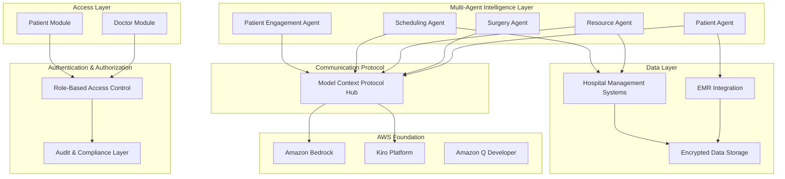

# Design Document

## Overview

The Clinical Decision Support System (CDSS) is a revolutionary AI-powered healthcare platform that combines role-based access control with a multi-agent architecture to address critical healthcare delivery challenges in India. The system leverages AWS Bedrock, Kiro platform, and Model Context Protocol (MCP) to create the world's first coordinated multi-agent healthcare orchestration platform.

### Key Innovation Areas

1. **Multi-Agent Healthcare Orchestration**: Five specialized AI agents working in coordination
2. **Automatic Specialist Replacement**: Real-time identification of qualified replacement doctors
3. **AI-Powered Conversation Intelligence**: Medical entity extraction and medication adherence
4. **India-First Localization**: Deep cultural and linguistic adaptation for Indian healthcare
5. **Real-Time Surgical Workflow Intelligence**: Live procedural support and resource optimization

## Architecture

### High-Level Architecture

The system follows a modular architecture with two primary access layers (Doctor Module and Patient Module) supported by five specialized AI agents communicating via MCP protocol.



### Role-Based Access Control (RBAC) Architecture

#### Doctor Module
- **Full Clinical Access**: Complete patient records, all AI agent capabilities
- **Administrative Tools**: Resource management, scheduling oversight, system configuration
- **Multi-Patient Management**: Access to all patients within authorized scope
- **AI Agent Interaction**: Direct communication with all five specialized agents

#### Patient Module  
- **Personal Health Access**: Own medical history, appointment scheduling, medication tracking
- **Engagement Features**: Conversation summaries, medication reminders, follow-up notifications
- **Limited AI Interaction**: Access only to Patient Engagement Agent for personal care

### Multi-Agent Architecture

#### Agent Specialization and Responsibilities

**1. Patient Agent**
- **Core Function**: Comprehensive patient profile management and clinical assessment
- **Capabilities**: 
  - Patient record creation and maintenance
  - Surgery readiness evaluation
  - Medical history analysis
  - Risk factor identification
- **MCP Interfaces**: EMR systems, clinical databases, medical knowledge bases

**2. Surgery Agent**
- **Core Function**: Surgical workflow analysis and procedural support
- **Capabilities**:
  - Surgery classification and complexity assessment
  - Resource requirement determination
  - Clinical guideline enforcement
  - Real-time procedural guidance
- **MCP Interfaces**: Surgical databases, equipment systems, procedural knowledge bases

**3. Resource Agent**
- **Core Function**: Real-time hospital resource tracking and optimization
- **Capabilities**:
  - Staff availability monitoring
  - Equipment status tracking
  - Conflict detection and resolution
  - Inventory management
- **MCP Interfaces**: Hospital management systems, scheduling systems, equipment databases

**4. Scheduling Agent**
- **Core Function**: Intelligent scheduling optimization and doctor replacement
- **Capabilities**:
  - Optimal schedule generation
  - Automatic specialist replacement identification
  - Workload balancing
  - Emergency prioritization
- **MCP Interfaces**: Scheduling systems, staff databases, availability APIs

**5. Patient Engagement Agent**
- **Core Function**: Conversation analysis and medication adherence management
- **Capabilities**:
  - Medical conversation transcription and analysis
  - Patient-friendly summary generation
  - Automated medication reminders
  - Adherence tracking and reporting
- **MCP Interfaces**: Communication systems, medication databases, patient portals

## Components and Interfaces

External system contracts (Hospital HIS, ABDM): see **[MCP_CONTRACTS.md](MCP_CONTRACTS.md)** for endpoints, auth, and payloads.

### Core System Components

#### 1. Authentication and Authorization Service
```typescript
interface AuthenticationService {
  authenticateUser(credentials: UserCredentials): Promise<AuthToken>
  authorizeAccess(token: AuthToken, resource: Resource): Promise<boolean>
  validateRole(userId: string): Promise<UserRole>
  auditAccess(userId: string, action: string, resource: string): void
}

enum UserRole {
  DOCTOR = "doctor",
  PATIENT = "patient", 
  ADMIN = "admin",
  NURSE = "nurse"
}
```

#### 2. MCP Communication Hub
```typescript
interface MCPHub {
  registerAgent(agent: AIAgent): Promise<void>
  routeMessage(from: AgentId, to: AgentId, message: MCPMessage): Promise<void>
  broadcastEvent(event: SystemEvent): Promise<void>
  handleAgentResponse(response: AgentResponse): Promise<void>
}

interface MCPMessage {
  id: string
  timestamp: Date
  from: AgentId
  to: AgentId
  type: MessageType
  payload: any
  priority: Priority
}
```

#### 3. Patient Management Interface
```typescript
interface PatientManagement {
  createPatient(data: PatientData): Promise<Patient>
  getPatientHistory(patientId: string): Promise<MedicalHistory>
  assessSurgeryReadiness(patientId: string): Promise<SurgeryReadiness>
  updatePatientRecord(patientId: string, updates: PatientUpdate): Promise<void>
}

interface Patient {
  id: string
  demographics: Demographics
  medicalHistory: MedicalHistory
  currentStatus: PatientStatus
  surgeryReadiness: SurgeryReadiness
}
```

#### 4. Surgical Workflow Interface
```typescript
interface SurgicalWorkflow {
  classifySurgery(request: SurgeryRequest): Promise<SurgeryClassification>
  determineRequirements(surgery: SurgeryClassification): Promise<SurgeryRequirements>
  provideProcedureGuidance(surgeryId: string): Promise<ProcedureGuidance>
  trackSurgicalProgress(surgeryId: string): Promise<SurgeryProgress>
}

interface SurgeryRequirements {
  instruments: Instrument[]
  team: TeamMember[]
  duration: Duration
  complexity: ComplexityLevel
  riskFactors: RiskFactor[]
}
```

#### 5. Resource Management Interface
```typescript
interface ResourceManagement {
  getStaffAvailability(specialty: Specialty, timeRange: TimeRange): Promise<StaffMember[]>
  getEquipmentStatus(equipmentType: EquipmentType): Promise<Equipment[]>
  detectConflicts(resourceRequest: ResourceRequest): Promise<Conflict[]>
  optimizeAllocation(requests: ResourceRequest[]): Promise<AllocationPlan>
}

interface StaffMember {
  id: string
  name: string
  specialty: Specialty
  availability: AvailabilityStatus
  currentWorkload: number
  qualifications: Qualification[]
}
```

#### 6. Intelligent Scheduling Interface
```typescript
interface IntelligentScheduling {
  optimizeSchedule(requests: ScheduleRequest[]): Promise<OptimalSchedule>
  findReplacement(unavailableDoctor: DoctorId, surgery: Surgery): Promise<ReplacementOptions>
  balanceWorkload(staff: StaffMember[], timeframe: TimeRange): Promise<WorkloadPlan>
  prioritizeEmergencies(requests: ScheduleRequest[]): Promise<PriorityQueue>
}

interface ReplacementOptions {
  primaryReplacements: DoctorReplacement[]
  secondaryReplacements: DoctorReplacement[]
  estimatedNotificationTime: Duration
  availabilityConfidence: number
}
```

#### 7. Patient Engagement Interface
```typescript
interface PatientEngagement {
  transcribeConversation(audioData: AudioData): Promise<ConversationTranscript>
  extractMedicalEntities(transcript: ConversationTranscript): Promise<MedicalEntities>
  generatePatientSummary(entities: MedicalEntities): Promise<PatientSummary>
  createMedicationReminders(prescription: Prescription): Promise<ReminderSchedule>
  trackAdherence(patientId: string): Promise<AdherenceReport>
}

interface MedicalEntities {
  symptoms: Symptom[]
  diagnoses: Diagnosis[]
  medications: Medication[]
  instructions: Instruction[]
  followUpActions: FollowUpAction[]
}
```

## Data Models

### Core Data Structures

#### Patient Data Model
```typescript
interface PatientRecord {
  // Identity
  patientId: string
  abhaId?: string // Ayushman Bharat Health Account ID
  demographics: Demographics
  
  // Medical Information
  medicalHistory: MedicalHistory
  currentConditions: Condition[]
  allergies: Allergy[]
  medications: CurrentMedication[]
  
  // Visit Information
  visits: Visit[]
  surgeries: Surgery[]
  
  // Engagement Data
  conversationSummaries: ConversationSummary[]
  adherenceHistory: AdherenceRecord[]
  
  // Metadata
  createdAt: Date
  updatedAt: Date
  lastVisit: Date
}

interface Demographics {
  name: string
  age: number
  gender: Gender
  language: Language
  address: Address
  emergencyContact: Contact
  culturalPreferences: CulturalPreference[]
}
```

#### Surgery Data Model
```typescript
interface Surgery {
  surgeryId: string
  patientId: string
  type: SurgeryType
  classification: SurgeryClassification
  
  // Scheduling
  scheduledDate: Date
  estimatedDuration: Duration
  priority: Priority
  
  // Team and Resources
  primarySurgeon: DoctorId
  surgicalTeam: TeamMember[]
  requiredEquipment: Equipment[]
  operatingRoom: OperatingRoom
  
  // Status and Progress
  status: SurgeryStatus
  progress: SurgeryProgress[]
  complications: Complication[]
  
  // Requirements and Guidelines
  requirements: SurgeryRequirements
  guidelines: ClinicalGuideline[]
  riskAssessment: RiskAssessment
}

enum SurgeryStatus {
  SCHEDULED = "scheduled",
  IN_PROGRESS = "in_progress", 
  COMPLETED = "completed",
  CANCELLED = "cancelled",
  DELAYED = "delayed"
}
```

#### Resource Data Model
```typescript
interface HospitalResource {
  resourceId: string
  type: ResourceType
  name: string
  
  // Availability
  availability: AvailabilityStatus
  schedule: Schedule[]
  conflicts: Conflict[]
  
  // Capabilities
  capabilities: Capability[]
  limitations: Limitation[]
  
  // Status
  currentStatus: ResourceStatus
  lastUpdated: Date
  maintenanceSchedule: MaintenanceWindow[]
}

interface StaffResource extends HospitalResource {
  employeeId: string
  specialty: Specialty
  qualifications: Qualification[]
  workload: WorkloadMetrics
  replacementOptions: ReplacementOption[]
}

interface EquipmentResource extends HospitalResource {
  model: string
  serialNumber: string
  operationalStatus: OperationalStatus
  calibrationDate: Date
  nextMaintenance: Date
}
```

#### Conversation Data Model
```typescript
interface ConversationRecord {
  conversationId: string
  patientId: string
  doctorId: string
  
  // Content
  transcript: ConversationTranscript
  extractedEntities: MedicalEntities
  patientSummary: PatientSummary
  
  // Metadata
  date: Date
  duration: Duration
  language: Language
  confidenceScore: number
  
  // Follow-up Actions
  prescriptions: Prescription[]
  followUpInstructions: Instruction[]
  medicationReminders: ReminderSchedule
}

interface ConversationTranscript {
  segments: TranscriptSegment[]
  medicalTerms: MedicalTerm[]
  keyFindings: KeyFinding[]
  actionItems: ActionItem[]
}
```

## Correctness Properties

*A property is a characteristic or behavior that should hold true across all valid executions of a system—essentially, a formal statement about what the system should do. Properties serve as the bridge between human-readable specifications and machine-verifiable correctness guarantees.*

Now I need to analyze the acceptance criteria to create correctness properties. Let me use the prework tool to systematically analyze each requirement.

### Property 1: Role-Based Access Control Enforcement
*For any* user authentication, the system should grant access only to resources and capabilities appropriate for their role, ensuring doctors can access all clinical tools while patients can only access their own medical information.
**Validates: Requirements 1.1, 1.2, 1.3, 1.5, 1.6, 1.7**

### Property 2: Patient Identity and Record Uniqueness  
*For any* patient registration or lookup, the system should create or retrieve exactly one unique Patient_ID per individual, preventing duplicate records while maintaining complete medical history integrity.
**Validates: Requirements 2.1, 2.7**

### Property 3: Comprehensive Medical Data Persistence
*For any* medical interaction (visit, treatment, prescription), the system should maintain complete chronological records with timestamps and treating physician information accessible for future clinical decisions.
**Validates: Requirements 2.2, 2.3**

### Property 4: Surgery Classification and Requirement Determination
*For any* surgery request, the Surgery_Agent should correctly classify the procedure type and complexity, then determine all required instruments, team members, and resources with appropriate clinical guardrails.
**Validates: Requirements 3.1, 3.2, 3.3, 3.4, 3.5**

### Property 5: Real-Time Surgical Procedural Support
*For any* ongoing surgical procedure, the Surgery_Agent should provide real-time instrument information, step-by-step guidance, and complication alerts without interrupting the surgical workflow.
**Validates: Requirements 3.6, 3.7**

### Property 6: Real-Time Resource Tracking and Conflict Detection
*For any* hospital resource (staff, equipment, operating rooms), the Resource_Agent should maintain accurate real-time availability status and immediately detect and alert on scheduling conflicts or shortages.
**Validates: Requirements 4.1, 4.2, 4.3, 4.4, 4.5, 4.6, 4.7**

### Property 7: Intelligent Scheduling Optimization
*For any* set of surgical scheduling requests, the Scheduling_Agent should generate optimal schedules that balance team availability, OT capacity, staff workload, and emergency prioritization while including appropriate buffer times.
**Validates: Requirements 5.1, 5.2, 5.3, 5.4, 5.7**

### Property 8: Automatic Specialist Replacement
*For any* doctor becoming unavailable for scheduled surgery, the Scheduling_Agent should instantly identify qualified replacement specialists and automatically notify all relevant team members about personnel changes.
**Validates: Requirements 5.5, 5.6**

### Property 9: Medical Conversation Intelligence
*For any* doctor-patient conversation, the Patient_Engagement_Agent should accurately transcribe the discussion, extract medical entities (symptoms, diagnoses, medications), and generate patient-friendly summaries capturing key clinical information.
**Validates: Requirements 6.1, 6.2, 6.3**

### Property 10: Automated Medication Adherence Management
*For any* prescription, the Patient_Engagement_Agent should create appropriate reminder schedules, send proactive notifications through multiple channels, and escalate to healthcare providers when non-adherence patterns are detected.
**Validates: Requirements 6.4, 6.5, 6.6, 6.7**

### Property 11: Comprehensive Multilingual Healthcare Support
*For any* medical content or communication, the system should provide accurate real-time translation between major Indian languages, simplify complex medical terminology for patient understanding, and adapt communication styles to respect regional cultural practices.
**Validates: Requirements 7.1, 7.2, 7.3, 7.4, 7.5, 7.6, 7.7**

### Property 12: MCP Agent Communication Coordination
*For any* patient data update or complex healthcare scenario, all relevant AI agents should receive real-time updates via MCP protocol and coordinate their responses while maintaining comprehensive audit logs of all inter-agent communications.
**Validates: Requirements 8.1, 8.2, 8.3, 8.4, 8.7**

### Property 13: Secure Agent Communication
*For any* inter-agent communication, the system should maintain patient data privacy and security while handling communication failures gracefully with appropriate fallback mechanisms.
**Validates: Requirements 8.5, 8.6**

### Property 14: Intelligent Alert and Emergency Response Management
*For any* critical medical event (drug interactions, emergency vitals, surgical complications), the system should generate immediate targeted alerts to relevant healthcare providers and trigger appropriate automated response protocols with multi-channel escalation until acknowledged.
**Validates: Requirements 9.1, 9.2, 9.3, 9.4, 9.6**

### Property 15: System Maintenance and Notification Management
*For any* system maintenance or notification event, the system should provide advance notice to users, maintain comprehensive audit trails of all notifications and response times, and offer alternative access methods during maintenance periods.
**Validates: Requirements 9.5, 9.7**

### Property 16: AWS Platform Integration
*For any* AI processing requirement, the system should seamlessly integrate with AWS Bedrock for foundation models, Amazon Q Developer for development assistance, and MCP servers for domain-specific functionality.
**Validates: Requirements 10.1, 10.2, 10.3**

### Property 17: Horizontal Scalability and Infrastructure Flexibility
*For any* increase in hospital locations, patient volume, or concurrent users, the system should scale efficiently while supporting deployment across diverse infrastructure types from rural to urban healthcare facilities.
**Validates: Requirements 10.4, 10.5, 10.6**

### Property 18: Healthcare Data Protection and Compliance
*For any* patient data operation, the system should maintain end-to-end encryption, comply with Indian data localization requirements, implement HIPAA-equivalent protection standards, and provide comprehensive audit trails for all medical data access.
**Validates: Requirements 10.7, 10.8, 10.9**

### Property 19: System Performance and Reliability
*For any* routine system operation, the system should maintain 99.5% uptime with sub-2-second response times while generating patient summaries and surgery readiness assessments within 30 seconds.
**Validates: Requirements 2.5, 10.10**

### Property 20: Clinical Assessment Generation
*For any* patient with medical history, the Patient_Agent should generate comprehensive surgery-readiness assessments including pre-operative status, risk factors, and structured clinical summaries suitable for medical decision-making.
**Validates: Requirements 2.4**

### Property 21: Multilingual Patient Data Support
*For any* patient data entry or retrieval, the Patient_Agent should support and accurately process information in Hindi, English, and major Indian regional languages while maintaining data integrity across language boundaries.
**Validates: Requirements 2.6**

### Property 22: Complete Activity Audit Trails
*For any* healthcare provider action or patient interaction, the system should maintain complete audit trails linked to appropriate Doctor_ID or Patient_ID with proper access controls ensuring only authorized personnel can view relevant activity histories.
**Validates: Requirements 1.4**

### Property 23: Multilingual Content Generation
*For any* prescription or patient education requirement, the system should generate accurate multilingual labels and educational materials while supporting speech recognition and synthesis in multiple Indian languages for accessibility.
**Validates: Requirements 7.3, 7.4**

### Property 24: Surgery Assessment and Blueprint Generation
*For any* surgery classification, the Surgery_Agent should provide comprehensive surgery-readiness assessments and generate detailed requirement blueprints including estimated duration, complexity factors, and risk assessments.
**Validates: Requirements 2.4, 3.5**

### Property 25: Inventory and Equipment Management
*For any* surgical instrument or medical equipment, the Resource_Agent should maintain accurate inventory tracking, monitor operational status, and provide current availability information for surgical planning and resource allocation.
**Validates: Requirements 4.5, 4.6**

## Error Handling

### Error Classification and Response Strategy

#### 1. Critical Medical Errors
**Scenarios**: Drug interaction alerts, emergency vital signs, surgical complications
**Response Strategy**:
- Immediate multi-channel alerts to relevant healthcare providers
- Automatic escalation protocols with increasing urgency
- Fallback to manual notification systems if automated alerts fail
- Comprehensive logging for post-incident analysis

#### 2. System Integration Errors
**Scenarios**: EMR connection failures, MCP communication breakdowns, AWS service interruptions
**Response Strategy**:
- Graceful degradation to offline capabilities where possible
- Automatic retry mechanisms with exponential backoff
- Alternative data sources and communication pathways
- User notification of reduced functionality with estimated restoration time

#### 3. Data Integrity Errors
**Scenarios**: Duplicate patient records, inconsistent medical history, corrupted conversation transcripts
**Response Strategy**:
- Automatic data validation and consistency checks
- Quarantine of suspicious data pending manual review
- Rollback capabilities for data corruption incidents
- Alert healthcare providers of potential data issues affecting patient care

#### 4. Authentication and Authorization Errors
**Scenarios**: Invalid user credentials, role permission violations, session timeouts
**Response Strategy**:
- Secure session termination and re-authentication requirements
- Detailed audit logging of all authentication failures
- Temporary account lockout for repeated failed attempts
- Administrative alerts for potential security breaches

#### 5. Performance and Scalability Errors
**Scenarios**: Response time degradation, concurrent user limits exceeded, resource exhaustion
**Response Strategy**:
- Automatic load balancing and resource scaling
- Priority queuing for critical medical operations
- User notification of system load with estimated wait times
- Graceful service degradation maintaining core functionality

### Error Recovery Mechanisms

#### Automatic Recovery
- **Database Transactions**: All medical data operations wrapped in ACID-compliant transactions
- **Message Queuing**: Reliable message delivery with automatic retry for agent communications
- **Circuit Breakers**: Automatic service isolation and recovery for failing components
- **Health Checks**: Continuous monitoring with automatic service restart capabilities

#### Manual Recovery Procedures
- **Data Restoration**: Point-in-time recovery from encrypted backups
- **Service Recovery**: Step-by-step procedures for manual service restoration
- **Emergency Protocols**: Offline procedures for critical medical operations during system outages
- **Escalation Procedures**: Clear escalation paths for technical and medical emergencies

## Testing Strategy

### Dual Testing Approach

The Clinical Decision Support System requires both unit testing and property-based testing to ensure comprehensive coverage of its complex multi-agent architecture and critical healthcare functionality.

#### Unit Testing Focus
Unit tests validate specific examples, edge cases, and integration points:

**Critical Unit Test Areas**:
- **Authentication Edge Cases**: Invalid credentials, expired tokens, role boundary conditions
- **Medical Data Validation**: Malformed patient records, invalid medical codes, data format edge cases  
- **Agent Integration Points**: MCP message format validation, agent handoff scenarios, communication timeouts
- **Emergency Scenarios**: Critical alert generation, escalation trigger conditions, failover mechanisms
- **Regulatory Compliance**: Data encryption verification, audit trail completeness, access control enforcement

**Integration Testing**:
- EMR system connectivity and data synchronization
- Hospital management system integration
- AWS service integration (Bedrock, Kiro, Q Developer)
- Multi-language processing and translation accuracy
- Real-time notification delivery across multiple channels

#### Property-Based Testing Configuration

Property tests verify universal correctness across all possible inputs using randomized test generation:

**Configuration Requirements**:
- **Minimum 100 iterations** per property test due to healthcare criticality
- **Extended iteration counts (500+)** for critical medical safety properties
- **Comprehensive input generation** covering medical terminology, patient demographics, surgical procedures
- **Cultural and linguistic diversity** in test data generation for Indian healthcare context

**Property Test Implementation**:
Each property test must reference its corresponding design document property using the tag format:
**Feature: clinical-decision-support-system, Property {number}: {property_text}**

**Critical Property Test Areas**:
- **Access Control Properties**: Role-based permissions across all user types and resource combinations
- **Medical Data Integrity**: Patient record consistency, medical history completeness, audit trail accuracy
- **Multi-Agent Coordination**: MCP communication reliability, agent response consistency, data synchronization
- **Real-Time Performance**: Response time consistency under varying loads, concurrent user handling
- **Multilingual Processing**: Translation accuracy across Indian languages, cultural adaptation correctness
- **Emergency Response**: Alert generation reliability, escalation timing, notification delivery success

**Test Data Generation Strategy**:
- **Synthetic Medical Data**: Realistic but anonymized patient records, medical histories, surgical procedures
- **Multilingual Test Cases**: Content in Hindi, English, Tamil, Bengali, and other major Indian languages
- **Cultural Variation**: Regional healthcare practices, cultural preferences, communication styles
- **Edge Case Generation**: Boundary conditions, error scenarios, system limit testing
- **Load Testing**: Concurrent user simulation, high-volume data processing, peak usage scenarios

**Healthcare-Specific Testing Considerations**:
- **Medical Accuracy Validation**: Clinical expert review of AI-generated recommendations and summaries
- **Regulatory Compliance Testing**: Data privacy, security, and Indian healthcare regulation adherence
- **Safety Critical Testing**: Extensive testing of emergency response, drug interaction detection, surgical support
- **Cultural Sensitivity Testing**: Verification of appropriate cultural adaptations and communication styles

The combination of comprehensive unit testing and extensive property-based testing ensures the system meets the highest standards of reliability, safety, and correctness required for healthcare applications serving India's diverse population.